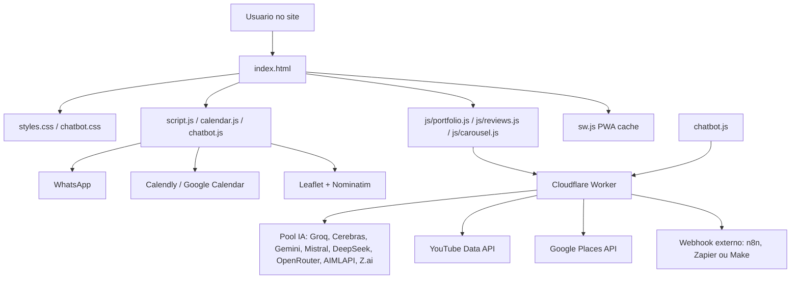
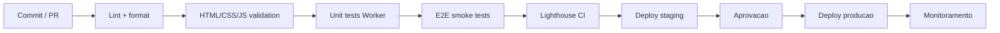
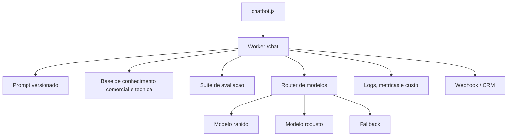

# Analise tecnica e documentacao do site Renostter

Data da analise: 2026-05-27  
Escopo: estrutura principal do site em `Site-Renostter`, excluindo a copia espelhada em `GITHUB-SITE` e arquivos internos de `.git`.

## 1. Resumo executivo

O site Renostter esta estruturado como uma aplicacao web estatica com HTML, CSS e JavaScript puros, enriquecida por PWA, chatbot com IA, integracoes de conversao, carrossel de videos, Google Places, Calendly, WhatsApp, mapa interativo e um Cloudflare Worker como camada de proxy para IA e APIs externas.

Do ponto de vista de produto, o projeto ja apresenta uma proposta forte: captar leads de manutencao, instalacao, higienizacao, PMOC e servicos tecnicos de climatizacao com uma experiencia visual rica e assistida por IA. Do ponto de vista de engenharia, a base funciona como um MVP avancado, mas ainda precisa evoluir em modularizacao, pipeline DevOps, observabilidade, testes, seguranca e governanca de IA.

Diagnostico central:

- Produto: forte orientacao a conversao, com CTAs recorrentes, chatbot SDR, agenda e WhatsApp.
- Frontend: rico em secoes, animacoes e interacoes, mas com arquivos muito grandes e responsabilidades misturadas.
- Backend/serverless: Worker bem posicionado como proxy seguro para chaves e fallback de provedores de IA.
- DevOps: ainda incipiente; falta automacao de build, lint, testes, deploy, verificacoes de performance e ambientes.
- AI-first: presente na experiencia do usuario, mas ainda sem avaliacao automatizada de prompts, metricas de qualidade, guardrails formais ou trilha de auditoria.

## 2. Inventario da estrutura

Arquivos principais analisados:

| Arquivo | Papel | Tamanho aproximado | Linhas |
|---|---:|---:|---:|
| `index.html` | Estrutura completa da landing page, SEO, secoes, modais e scripts inline | 90,7 KB | 1467 |
| `styles.css` | Estilos globais, responsividade, UI, animacoes e secoes | 77,1 KB | 3155 |
| `chatbot.js` | Chatbot Lucas IA, prompt, fallback, historico, leads e acoes | 57,5 KB | 820 |
| `chatbot.css` | Estilo do widget de chat | 12,2 KB | 503 |
| `script.js` | Navbar, scroll, contadores, status, modal de pintura e eventos | 8,8 KB | 214 |
| `calendar.js` | Fluxo de agendamento, Google Calendar e WhatsApp | 14,4 KB | 290 |
| `js/portfolio.js` | Videos do YouTube via Worker e Swiper | 12,3 KB | 269 |
| `js/reviews.js` | Avaliacoes Google via Worker e cache local | 10,5 KB | 220 |
| `js/carousel.js` | Carrossel tecnico horizontal | 2,4 KB | 53 |
| `sw.js` | Service Worker e cache PWA | 2,8 KB | 85 |
| `manifest.json` | Manifesto PWA | 0,9 KB | 34 |
| `proxy/worker.js` | Cloudflare Worker para IA, YouTube, Places e leads | 18,5 KB | 373 |
| `proxy/wrangler.toml` | Configuracao de deploy do Worker | 0,7 KB | - |

Pastas relevantes:

- `assets/`: imagens, videos, logos e marcas.
- `assets/residencial/`: imagens de servicos residenciais.
- `assets/empresarial/`: imagens de projetos corporativos.
- `assets/marcas/`: logos de fabricantes atendidos.
- `js/`: modulos adicionais de portfolio, avaliacoes e carrossel.
- `proxy/`: camada serverless em Cloudflare Workers.
- `GITHUB-SITE/`: copia espelhada da estrutura principal, aparentemente usada para publicacao ou backup.

## 3. Arquitetura atual

### Frontend

O frontend e uma landing page unica com secoes de alto impacto:

- hero com video de fundo;
- marcas atendidas;
- numeros de autoridade;
- servicos;
- portfolio e videos;
- avaliacoes Google;
- cobertura por mapa;
- agendamento;
- contato;
- chatbot IA;
- modais de termos, avaliacao Google e simulador de pintura.

Pontos fortes:

- Boa cobertura de intencoes de conversao.
- Uso de dados estruturados `LocalBusiness` e `Service`.
- Lazy loading em imagens e videos dinamicos.
- PWA com manifest e service worker.
- Experiencia rica sem depender de framework.

Pontos de atencao:

- `index.html` concentra muito conteudo, scripts inline e logica de negocio.
- `styles.css` tem mais de 3000 linhas, dificultando manutencao e revisao.
- Ha dependencias externas por CDN sem estrategia visivel de pinagem com SRI.
- Varios blocos usam `innerHTML`; ha sanitizacao no chat, mas nem todos os pontos dinamicos tem o mesmo nivel de protecao.

### Worker serverless

O `proxy/worker.js` concentra:

- proxy de IA com fallback multi-provedor;
- conversao de payload Gemini para formato OpenAI;
- endpoint de leads;
- endpoint de YouTube;
- endpoint de Google Places;
- CORS;
- rate limit em memoria.

Pontos fortes:

- Chaves ficam do lado serverless via `wrangler secret put`.
- Fallback em cascata aumenta disponibilidade da IA.
- Worker reduz exposicao direta de APIs externas no navegador.
- Estrutura pronta para webhook de leads.

Pontos de atencao:

- Rate limiting em `Map` e volatil por instancia; pode falhar em escala ou cold starts.
- `RATE_LIMIT_RPM` esta em `wrangler.toml`, mas o codigo usa constante fixa.
- Nao ha logs estruturados, correlation id, metricas de latencia ou taxa de falha por provedor.
- Nao ha testes automatizados do Worker.
- O endpoint de IA aceita payload amplo; vale impor limites de tamanho e validacao de esquema.

## 4. Analise DevOps

### Estado atual

O projeto tem alguns sinais de operacao moderna:

- repositorio Git existente;
- Cloudflare Worker configurado com `wrangler.toml`;
- PWA com service worker;
- separacao parcial entre frontend e proxy;
- comentarios de deploy e secrets no Worker.

Ainda nao ha evidencias de:

- `package.json`;
- scripts padronizados de desenvolvimento;
- pipeline CI/CD;
- testes automatizados;
- lint/format;
- checagem de HTML/CSS/JS;
- Lighthouse CI;
- politica de versionamento de cache;
- ambientes `dev`, `staging`, `prod`;
- observabilidade estruturada;
- monitoramento de uptime e erros.

### Pipeline recomendado

Recomendacoes DevOps:

1. Criar `package.json` com scripts:
   - `dev`: servidor local estatico;
   - `lint`: ESLint;
   - `format`: Prettier;
   - `test`: Vitest ou equivalente para funcoes puras;
   - `test:e2e`: Playwright;
   - `lighthouse`: Lighthouse CI;
   - `deploy:worker`: `wrangler deploy`.

2. Criar GitHub Actions:
   - validacao em pull request;
   - deploy do Worker somente em branch principal;
   - publicacao do site estatico com etapa de smoke test.

3. Separar ambientes:
   - `dev`: Worker local com `wrangler dev`;
   - `staging`: dominio de homologacao;
   - `prod`: `renostter.com`.

4. Definir estrategia de cache:
   - versionar `CACHE_NAME` automaticamente;
   - evitar cache permanente de arquivos grandes sem busting;
   - adicionar estrategia para limpar cache quando CSS/JS mudarem.

5. Adicionar observabilidade:
   - logs JSON no Worker;
   - metricas de erro por rota;
   - metricas por provedor de IA;
   - tempo medio de resposta;
   - taxa de conversao de chatbot para WhatsApp/Calendly;
   - alerta para falha de YouTube/Places/IA.

## 5. Analise AI-first

### O que ja existe

O site ja possui um assistente IA chamado Lucas, com papel de SDR e especialista tecnico em climatizacao. O chatbot:

- usa prompt estruturado;
- trabalha com SPIN Selling;
- possui base tecnica embutida;
- oferece fallback local sem IA;
- captura lead;
- executa acoes estruturadas como Calendly, WhatsApp, quick replies e lead;
- usa proxy serverless para evitar chave exposta no frontend;
- persiste historico em `sessionStorage`.

O Worker tambem foi desenhado com mentalidade AI-first:

- pool multi-provedor;
- fallback em cascata;
- suporte a formatos Gemini e OpenAI;
- tolerancia a falhas 429/5xx;
- timeout por provedor.

### Lacunas de maturidade AI-first

1. Prompt monolitico no frontend:
   - O `SYSTEM_PROMPT` esta dentro de `chatbot.js`.
   - Isso dificulta versionamento, teste A/B, auditoria e atualizacao sem deploy completo do site.

2. Ausencia de avaliacao automatizada:
   - Nao ha suite de perguntas/respostas esperadas.
   - Nao ha medicao de alucinacao, aderencia a preco, coleta de lead ou tom de voz.

3. Pouca governanca:
   - Precos, normas e politicas estao embutidos no prompt.
   - Mudancas comerciais exigem edicao manual de codigo.

4. Pouca telemetria de IA:
   - Nao ha registro de provedor escolhido, erro por provedor, custo estimado, tempo ate primeira resposta ou taxa de fallback.

5. LGPD e privacidade:
   - O chatbot coleta nome, servico, tipo e urgencia.
   - Ha persistencia local de lead e historico.
   - Recomenda-se deixar explicito no fluxo como esses dados sao tratados e adicionar politica operacional de retencao.

### Arquitetura AI-first recomendada

Recomendacoes AI-first:

- mover prompt e base de conhecimento para o Worker;
- criar `prompts/lucas-sdr.md` e versionar alteracoes;
- criar dataset de avaliacao com 30 a 50 cenarios reais;
- validar saida estruturada com JSON schema;
- registrar eventos de lead, agendamento, fallback e erro;
- permitir configuracao de precos/servicos via JSON;
- adicionar protecao contra prompt injection;
- implementar regras para nao prometer prazos, garantias ou precos finais fora da politica real.

## 6. Seguranca, privacidade e conformidade

Pontos positivos:

- chaves sensiveis foram removidas do frontend e documentadas como secrets do Worker;
- links externos usam `rel="noopener"` em varios pontos;
- o chat sanitiza texto antes de renderizar mensagens;
- CORS do Worker limita origens conhecidas.

Riscos e melhorias:

- `innerHTML` e usado em varios modulos; entradas externas como reviews, titulos de YouTube e respostas de APIs devem ser escapadas de forma consistente.
- O Worker deve validar tamanho do payload e schema de entrada.
- O rate limit atual em memoria nao e suficiente para abuso distribuido.
- CDN externos deveriam usar SRI ou ser empacotados localmente.
- O tratamento LGPD do chatbot deveria ser mais explicito.
- Logs de lead devem evitar dados pessoais em texto livre quando enviados a ferramentas externas.

## 7. Performance e UX

Pontos fortes:

- lazy loading em muitas imagens;
- lite embed para YouTube;
- service worker;
- carrossel sob demanda com IntersectionObserver;
- cache local para reviews e Place ID;
- video hero com poster.

Pontos de atencao:

- `assets/hero-background.mp4` tem aproximadamente 11,72 MB, grande para primeira dobra.
- CSS global com 3155 linhas aumenta custo de download e manutencao.
- HTML com scripts inline e varias responsabilidades pode impactar cache e revisao.
- Multiplas dependencias externas carregadas por CDN podem afetar TTI e disponibilidade.
- Falta medicao automatizada de Core Web Vitals.

Melhorias recomendadas:

- gerar versoes WebM/MP4 otimizadas do video hero;
- usar poster de alta qualidade e carregar video de forma adaptativa;
- quebrar CSS por dominios ou usar build que gere CSS minificado;
- adiar scripts nao essenciais;
- auditar tamanho das imagens antigas `.old`;
- remover assets duplicados e copias quando nao forem necessarias;
- rodar Lighthouse CI em mobile e desktop.

## 8. Manutenibilidade

Principais gargalos:

- CSS muito grande e centralizado.
- HTML concentra secoes, scripts, schema, modais e regras.
- Duplicacao em `GITHUB-SITE` aumenta risco de divergencia.
- Configuracoes repetidas de URLs, WhatsApp, Worker e Place ID.
- Ausencia de padrao formal de documentacao e onboarding.

Refatoracao sugerida:

1. Criar `src/config/site.js` ou `config.json`:
   - telefone;
   - WhatsApp;
   - Calendly;
   - Worker URL;
   - redes sociais;
   - Place ID;
   - precos;
   - areas atendidas.

2. Dividir JavaScript por dominio:
   - `nav.js`;
   - `coverage-map.js`;
   - `pricing-calculator.js`;
   - `chatbot.js`;
   - `calendar.js`;
   - `reviews.js`;
   - `portfolio.js`.

3. Dividir CSS por secao:
   - `base.css`;
   - `layout.css`;
   - `components.css`;
   - `sections/*.css`;
   - `chatbot.css`.

4. Criar documentacao operacional:
   - `README.md`;
   - `docs/DEPLOY.md`;
   - `docs/AI_GOVERNANCE.md`;
   - `docs/RUNBOOK.md`;
   - `docs/SEO.md`.

## 9. Matriz de melhorias priorizadas

| Prioridade | Melhoria | Impacto | Esforco |
|---|---|---:|---:|
| P0 | Adicionar pipeline CI com lint, validacao e smoke test | Alto | Medio |
| P0 | Validar payloads e limitar tamanho no Worker | Alto | Baixo |
| P0 | Escapar todos os dados externos antes de `innerHTML` | Alto | Medio |
| P0 | Criar documentacao de deploy e secrets | Alto | Baixo |
| P1 | Otimizar video hero de 11,72 MB | Alto | Medio |
| P1 | Mover prompt/base do chatbot para Worker | Alto | Medio |
| P1 | Criar suite de avaliacao do chatbot | Alto | Medio |
| P1 | Versionar cache do service worker por release | Medio | Baixo |
| P1 | Criar ambiente staging | Medio | Medio |
| P2 | Modularizar CSS e JS | Alto | Alto |
| P2 | Adicionar Lighthouse CI | Medio | Baixo |
| P2 | Observabilidade de Worker e conversao | Alto | Medio |
| P2 | Remover duplicacao `GITHUB-SITE` ou documentar finalidade | Medio | Baixo |
| P3 | A/B testing de CTAs e prompt | Medio | Medio |
| P3 | Integracao CRM formal | Alto | Medio |

## 10. Roadmap sugerido

### Sprint 1: Fundacao de qualidade

- Criar `README.md` com arquitetura, execucao local e deploy.
- Criar `docs/DEPLOY.md` para Cloudflare Worker e site estatico.
- Adicionar `package.json` com scripts de lint, format e servidor local.
- Adicionar ESLint/Prettier.
- Criar GitHub Actions para validacao.
- Ajustar Worker para ler `RATE_LIMIT_RPM` de `env`.
- Adicionar limite de payload e validacao basica no Worker.

### Sprint 2: Performance e seguranca

- Otimizar `hero-background.mp4`.
- Criar estrategia de cache busting para `sw.js`.
- Escapar dados dinamicos de YouTube e Google Places.
- Adicionar headers de seguranca no ambiente de hospedagem.
- Adicionar Lighthouse CI.

### Sprint 3: AI-first operacional

- Mover prompt para o Worker.
- Criar versao de prompt e changelog.
- Criar dataset de testes do Lucas IA.
- Medir taxa de conversao, fallback e erro por provedor.
- Criar dashboard simples de leads e eventos.

### Sprint 4: Modularizacao e escalabilidade

- Quebrar `index.html` em componentes ou migrar para build estatico leve.
- Dividir CSS por dominio.
- Criar configuracao central de negocio.
- Integrar leads com CRM ou automacao n8n/Make/Zapier.

## 11. Conclusao

O site Renostter esta em um estagio acima de uma landing page comum: ele combina presenca institucional, prova social, funil de conversao, PWA e IA conversacional. A principal oportunidade agora e transformar essa base em um produto web operavel: com pipeline, testes, metricas, governanca de IA, seguranca e documentacao.

As melhorias de maior retorno sao: pipeline DevOps, endurecimento do Worker, otimizacao do video hero, governanca do prompt do Lucas IA e observabilidade de conversao. Isso preserva o que o site ja tem de forte e cria uma base mais confiavel para crescer sem fragilizar a experiencia.
