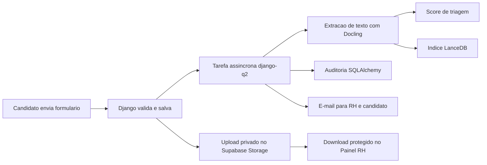
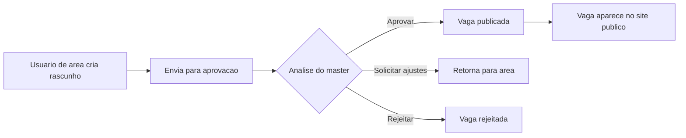
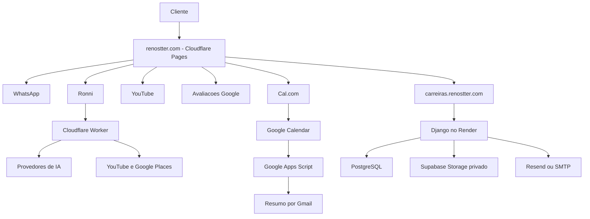

# Inventario Completo do Site Renostter

Documento de referencia do ecossistema Renostter, atualizado em 10 de junho de 2026.

Este inventario descreve o que existe no repositorio, quais recursos aparecem para clientes e candidatos, como as integracoes funcionam e onde cada parte esta hospedada. Credenciais, senhas, tokens e chaves privadas nao sao registrados neste documento.

## 1. Visao geral

O projeto e composto por quatro blocos principais:

1. Site institucional estatico da Renostter.
2. Chatbot de atendimento com inteligencia artificial, chamado Ronni.
3. Sistema de carreiras e Painel RH desenvolvido em Django.
4. Automacoes de agendamento, e-mail, armazenamento e notificacao.

Tambem existem implementacoes PHP e Next.js/Supabase mantidas como referencia historica ou alternativa tecnica. A aplicacao de carreiras em uso e a versao Django.

## 2. Enderecos principais

| Finalidade | Endereco |
| --- | --- |
| Site institucional | `https://renostter.com` |
| Site com `www` | `https://www.renostter.com` |
| Preview do site estatico | `https://renostter-pages.pages.dev` |
| Trabalhe Conosco | `https://carreiras.renostter.com/trabalhe-conosco/` |
| Candidatura | `https://carreiras.renostter.com/candidatar/?vaga=ID` |
| Login do Painel RH | `https://carreiras.renostter.com/admin/login/` |
| Painel de vagas | `https://carreiras.renostter.com/admin/vagas/` |
| Lista de candidaturas | `https://carreiras.renostter.com/admin/candidaturas/` |
| Gestao de usuarios | `https://carreiras.renostter.com/admin/usuarios/` |
| Aprovacoes | `https://carreiras.renostter.com/admin/aprovacoes/` |
| Agendamento Cal.com | `https://cal.com/renostter-hbubv8/comercial-renostter` |
| Proxy de IA | `https://renostter-gemini-proxy.adminrenostter.workers.dev` |

## 3. Site institucional

O site principal e uma aplicacao estatica baseada em HTML, CSS e JavaScript. O arquivo inicial e `index.html`.

### 3.1 Navegacao

O menu principal possui acesso a:

- Trabalhe Conosco;
- Servicos;
- Portfolio;
- Cobertura;
- Agendamento;
- Orcamento gratuito.

O menu possui comportamento responsivo para desktop e dispositivos moveis, incluindo botao hamburger.

### 3.2 Hero principal

O primeiro bloco apresenta:

- video de fundo relacionado a climatizacao;
- chamada principal de instalacao e manutencao de ar-condicionado;
- texto comercial de apoio;
- botao de contato/orcamento;
- indicadores de experiencia e atendimentos.

Assets associados:

- `assets/hero-background.mp4`;
- `assets/logo-dinamico.webm`;
- `assets/logo.png`.

### 3.3 Marcas parceiras

O site apresenta marcas atendidas ou relacionadas aos servicos:

- LG;
- Samsung;
- Midea;
- Daikin;
- Gree;
- Elgin;
- Springer;
- Electrolux;
- Consul;
- TCL;
- Philco.

As imagens ficam em `assets/marcas/`.

### 3.4 Numeros da empresa

A secao de indicadores utiliza contadores animados para apresentar dados comerciais e de experiencia. As animacoes sao disparadas quando a secao entra na area visivel da pagina.

### 3.5 Servicos apresentados

O site divulga os seguintes servicos:

- projeto e consultoria;
- instalacao de equipamentos;
- manutencao preventiva;
- manutencao corretiva;
- limpeza e higienizacao;
- recarga de gas refrigerante;
- laudo tecnico;
- limpeza de dutos;
- remocao e reinstalacao;
- contratos de manutencao;
- PMOC;
- pintura personalizada de equipamentos.

### 3.6 Pintura de equipamentos

Existe uma experiencia especifica para pintura de ar-condicionado:

- banner comercial;
- modal de personalizacao;
- simulador visual de cores;
- selecao de amostras;
- oferta promocional;
- CTA para solicitar orcamento pelo WhatsApp.

### 3.7 Portfolio e Canal Renostter

A area de portfolio utiliza imagens de projetos residenciais e empresariais localizadas em:

- `assets/residencial/`;
- `assets/empresarial/`.

A secao Canal Renostter exibe videos do YouTube em formato leve:

- carrega inicialmente thumbnails, sem iframe pesado;
- apresenta entre tres e quatro videos quando disponiveis;
- substitui a thumbnail por um player `youtube-nocookie.com` somente ao clicar;
- mantem apenas um video ativo por vez;
- usa videos estaticos de fallback quando a API nao responde;
- consulta a API por meio do Cloudflare Worker, sem expor a chave do YouTube no navegador.

Implementacao principal: `js/portfolio.js`.

### 3.8 Diferenciais

A secao de diferenciais comunica pontos como:

- atendimento tecnico;
- responsabilidade e transparencia;
- agilidade;
- garantia e qualidade;
- suporte por WhatsApp;
- experiencia em climatizacao residencial e empresarial.

### 3.9 Cobertura, mapa e CEP

A cobertura informada e Sao Paulo e Grande Sao Paulo.

O site oferece:

- mapa interativo com Leaflet;
- geolocalizacao opcional do navegador;
- consulta por CEP;
- estimativa de atendimento conforme localizacao;
- CTA para orcamento/agendamento.

### 3.10 Contato

Os canais apresentados incluem:

- WhatsApp;
- telefone;
- e-mail comercial;
- Instagram;
- Facebook;
- horario de atendimento;
- indicador visual de aberto ou fechado conforme dia e hora.

O WhatsApp principal configurado no site e `+55 11 95273-0593`.

### 3.11 Formulario de agendamento do site

O formulario proprio possui quatro etapas:

1. Escolha do servico.
2. Data, horario, endereco e tipo de local.
3. Nome, telefone e observacoes.
4. Revisao e confirmacao.

O fluxo pode:

- gerar resumo do atendimento;
- abrir o agendamento externo;
- preparar mensagem de confirmacao no WhatsApp;
- apresentar estado de sucesso;
- registrar eventos de analytics.

Logica principal: `calendar.js`.

### 3.12 Integracao Cal.com

O agendamento externo abre dentro de um modal responsivo por iframe:

- URL publica do tipo de evento no Cal.com;
- layout adaptado para celular;
- alternativa para abrir diretamente no Cal.com;
- alternativa para confirmar pelo WhatsApp;
- botao manual `Ja finalizei meu agendamento` como contingencia;
- deteccao de eventos de sucesso enviados pelo Cal.com;
- limpeza do iframe quando o modal e fechado.

### 3.13 Pop-up de agradecimento

Apos a conclusao do agendamento, o cliente recebe um pop-up com:

- confirmacao visual de agendamento recebido;
- mensagem de agradecimento;
- orientacao de que a equipe acompanhara a solicitacao;
- botao para confirmar pelo WhatsApp;
- botao para concluir e fechar a experiencia.

O pop-up abre automaticamente quando o Cal.com informa sucesso e tambem pelo botao manual de confirmacao.

### 3.14 Pagina de confirmacao de agendamento

Arquivos:

- `confirmacao-agendamento.html`;
- `confirmacao-agendamento.js`.

A pagina aceita dados pela URL, mostra um resumo do agendamento e prepara uma mensagem para WhatsApp. Ela foi criada para fluxos com redirecionamento do Cal.com, Pipedream ou outras automacoes.

### 3.15 Avaliacoes do Google

O site possui integracao para:

- localizar o perfil da empresa pelo Place ID;
- carregar avaliacoes quando a API esta disponivel;
- melhorar cards estaticos quando a API nao responde;
- abrir modal convidando o cliente a avaliar o atendimento;
- direcionar para a pagina de avaliacao do Google.

Implementacao: `js/reviews.js`.

### 3.16 Termos e LGPD

Existe um modal de Termos de Servico contendo:

- aceitacao dos termos;
- objeto do site;
- responsabilidades do usuario;
- regras de servicos e orcamentos;
- pagamentos;
- propriedade intelectual;
- limitacao de responsabilidade;
- privacidade e protecao de dados;
- alteracoes dos termos;
- legislacao e foro.

## 4. Chatbot Ronni

O chatbot de atendimento se chama Ronni e aparece como widget flutuante.

Arquivos:

- `chatbot.js`;
- `chatbot.css`;
- `assets/lucas-ai.jpg`.

### 4.1 Recursos do chatbot

- saudacao automatica;
- respostas sobre instalacao, manutencao, higienizacao, PMOC e climatizacao;
- orientacao de BTU;
- diagnostico inicial de problemas;
- respostas sobre precos de referencia;
- botoes de resposta rapida;
- abertura do WhatsApp com mensagem pronta;
- abertura direta do Cal.com para intencoes de agendamento;
- captura progressiva de dados do lead;
- historico da conversa em `sessionStorage`;
- fallback local quando os provedores de IA estao indisponiveis;
- compatibilidade temporaria com o nome antigo `LucasChat`.

### 4.2 Precos de referencia do Ronni

O chatbot possui referencias comerciais iniciais para:

- instalacao Split de 9.000 a 30.000 BTU;
- instalacao Piso-Teto/Cassete de 9.000 a 30.000 BTU;
- manutencao preventiva simples, Cassete e Piso-Teto;
- manutencao corretiva;
- higienizacao completa;
- recarga de gas R-410A, R-32 e R-22;
- PMOC;
- remocao e reinstalacao;
- contratos de manutencao;
- laudo tecnico;
- instalacao personalizada;
- pintura de equipamento.

Os valores sao tratados como estimativas. O chatbot informa que o preco final depende de avaliacao tecnica, acesso, infraestrutura, tubulacao, eletrica, distancia, carga termica e condicoes do local.

### 4.3 Deteccao de agendamento

Quando o cliente escreve termos como `agendar`, `agenda`, `marcar visita` ou `horario disponivel`, o Ronni prioriza a abertura do fluxo Cal.com.

### 4.4 Captura de leads

O chatbot pode enviar ao proxy dados sanitizados como:

- nome;
- servico;
- tipo de local;
- urgencia;
- bairro;
- mensagem;
- pagina de origem;
- user agent.

Quando o webhook externo nao esta configurado, o lead continua disponivel localmente para a sessao, sem quebrar o atendimento.

## 5. Cloudflare Worker de IA e APIs

Arquivo principal: `proxy/worker.js`.

O Worker funciona como camada segura entre o site e servicos externos. As chaves ficam em secrets do Cloudflare, nunca no navegador.

### 5.1 Endpoints

| Endpoint | Funcao |
| --- | --- |
| `POST /` | Processamento das mensagens do chatbot |
| `POST /lead` | Captura e encaminhamento de leads |
| `GET /youtube` | Consulta de videos do canal |
| `GET /places/find` | Localizacao/teste do estabelecimento no Google |
| `GET /places` | Consulta de dados e avaliacoes do Google Places |

### 5.2 Provedores de IA

O Worker aceita uma cadeia de fallback com os seguintes provedores:

1. Groq;
2. Cerebras;
3. Google Gemini;
4. Mistral;
5. DeepSeek;
6. OpenRouter;
7. AIMLAPI;
8. Together/ZAI, sujeito a validacao do endpoint configurado.

O uso real de cada provedor depende da existencia da respectiva chave secreta no Cloudflare.

### 5.3 Protecoes do Worker

- CORS limitado as origens permitidas;
- rate limit configuravel por minuto;
- validacao e sanitizacao dos leads;
- limite do historico enviado ao chat;
- limite de tamanho das mensagens;
- normalizacao de parametros de geracao;
- prompt operacional controlado pelo servidor;
- fallback textual quando todos os provedores falham;
- observabilidade ativada no Cloudflare.

## 6. PWA e funcionamento offline

O site possui recursos de Progressive Web App:

- `manifest.json`;
- `sw.js`;
- banner de instalacao;
- icones e identidade da Renostter;
- modo standalone;
- cache de HTML, CSS, JavaScript, logotipo, chatbot e imagens de marcas.

Estrategia de cache:

- HTML: network-first, com fallback no cache;
- assets estaticos: cache-first;
- requisicoes de API e proxy: nao sao interceptadas pelo cache estatico.

## 7. SEO, analytics e rastreamento

### 7.1 SEO

O projeto inclui:

- metatags de titulo e descricao;
- Open Graph;
- dados estruturados;
- `robots.txt`;
- `sitemap.xml`;
- URLs canonicas;
- configuracoes documentadas em `docs/SEO.md`.

### 7.2 Google Tag Manager

O container instalado e `GTM-NKMTQP6S`.

O GTM esta inserido:

- no topo do `head`;
- como bloco `noscript` logo apos a abertura do `body`.

Eventos customizados existentes ou preparados incluem:

- visualizacao de componentes;
- confirmacao de agendamento;
- sucesso do Cal.com;
- abertura do pop-up de agradecimento;
- interacoes comerciais relevantes.

## 8. Trabalhe Conosco e Painel RH

A implementacao ativa fica em `django-trabalhe-conosco/` e e hospedada separadamente do site estatico.

### 8.1 Area publica de vagas

Rota: `/trabalhe-conosco/`.

Recursos:

- lista apenas vagas publicadas e aprovadas;
- exclui vagas expiradas;
- busca por texto;
- filtros por area, modalidade e contrato;
- paginacao;
- exibicao de local, modalidade, contrato e informacao salarial;
- mensagem alternativa quando nao existem vagas;
- link de candidatura por vaga.

### 8.2 Formulario de candidatura

Rota: `/candidatar/?vaga=ID`.

Campos:

- nome;
- e-mail;
- telefone;
- mensagem;
- curriculo PDF, DOC ou DOCX.

Protecoes e validacoes:

- CSRF do Django;
- verificacao de vaga ainda aberta;
- validacao de extensao;
- validacao de assinatura/conteudo do arquivo;
- limite de tamanho;
- rate limit por origem;
- nomes de arquivos internos gerados com UUID.

### 8.3 Fluxo da candidatura



### 8.4 Painel de vagas

Rotas principais:

- `/admin/vagas/`;
- `/admin/vagas/nova/`;
- `/admin/vagas/<id>/editar/`;
- `/admin/vagas/<id>/excluir/`;
- `/admin/vagas/<id>/duplicar/`;
- `/admin/vagas/<id>/enviar-aprovacao/`.

Campos de vaga:

- titulo;
- descricao;
- requisitos;
- beneficios;
- localizacao;
- modalidade: presencial, remoto ou hibrido;
- contrato: CLT, PJ, Estagio ou Freelancer;
- area;
- informacao salarial: a combinar, valor salarial ou pretensao salarial;
- valor ou faixa salarial;
- status;
- prazo de expiracao;
- notas internas;
- motivo de rejeicao ou ajustes.

### 8.5 Fluxo de aprovacao



Somente vagas aprovadas pelo master, publicadas e dentro da validade aparecem para candidatos.

### 8.6 Perfis e permissoes

| Perfil | Permissoes principais |
| --- | --- |
| Master | Acesso total, usuarios, aprovacoes, publicacao e exclusoes permitidas |
| Gestor de area | Cria e acompanha vagas da propria area |
| Recrutador de area | Cria rascunhos e envia vagas para aprovacao |
| Visualizador | Consulta dados permitidos da propria area |

Regras adicionais:

- o master pode criar, editar e excluir usuarios comuns;
- contas master nao podem ser excluidas pelo painel;
- o master nao pode excluir a propria conta;
- usuarios de area sao limitados conforme perfil e area;
- senhas podem exigir troca no primeiro acesso;
- existe recuperacao de senha por e-mail.

### 8.7 Candidaturas no Painel RH

Rota: `/admin/candidaturas/`.

O painel apresenta:

- candidato;
- arquivo original;
- vaga;
- e-mail;
- telefone;
- score de QA;
- data de candidatura;
- acao para baixar curriculo.

O download tenta usar o Supabase Storage privado. Quando aplicavel em desenvolvimento, tambem existe suporte ao armazenamento local privado.

### 8.8 Armazenamento de curriculos

Estrutura recomendada e implementada:

- bucket privado `curriculos` no Supabase;
- acesso servidor a servidor com `service_role`;
- chave nunca exposta no frontend;
- links assinados temporarios ou download autenticado;
- suporte a PDF, DOC e DOCX;
- curriculos organizados por vaga, ano e mes.

### 8.9 E-mails de candidatura

O sistema pode usar Resend ou SMTP configurado no servidor.

Mensagens previstas:

- confirmacao para o candidato;
- notificacao para o RH;
- dados preenchidos pelo candidato;
- titulo da vaga;
- curriculo anexado quando disponivel;
- templates HTML proprios.

### 8.10 Processamento e triagem

Tecnologias usadas:

- Django;
- django-q2;
- Docling;
- LanceDB;
- SQLAlchemy;
- python-decouple;
- tzlocal;
- Agno opcional.

O processamento assincrono evita que extracao de curriculo, indexacao e envio de e-mail bloqueiem a resposta do formulario.

### 8.11 LGPD e limpeza de dados

As candidaturas possuem prazo de retencao. O comando `purge_expired_applications`:

- remove o curriculo do Supabase;
- remove eventual arquivo local;
- anonimiza nome, e-mail, telefone e mensagem;
- remove texto extraido e score;
- registra data e motivo da exclusao;
- preserva apenas dados minimos para auditoria operacional.

O comando `monitor_storage_usage`:

- mede o uso do armazenamento local/Render;
- mede os objetos do bucket Supabase;
- compara com o limite configurado;
- pode executar limpeza de candidaturas expiradas ao atingir o percentual definido, normalmente 95%;
- possui modo `--dry-run` para simulacao segura.

### 8.12 Comandos administrativos Django

| Comando | Finalidade |
| --- | --- |
| `create_master_user` | Cria ou atualiza o usuario master |
| `seed_careers` | Insere dados iniciais de desenvolvimento |
| `configure_supabase_storage` | Valida bucket, upload, download e exclusao |
| `monitor_storage_usage` | Monitora consumo e pode acionar limpeza |
| `purge_expired_applications` | Anonimiza candidaturas vencidas pela politica LGPD |

## 9. Automacoes de agendamento

### 9.1 Google Apps Script

Arquivo: `scripts/google-apps-script/renostter-agendamento-resumo.gs`.

O script:

- le o Google Calendar conectado ao Cal.com;
- identifica eventos futuros ainda nao notificados;
- envia resumo HTML ao Gmail;
- evita duplicidade por ID do evento;
- cria botoes com mensagem pronta para WhatsApp;
- pode rodar a cada 15 minutos;
- oferece funcao de diagnostico e funcao de teste.

Documentacao: `docs/GOOGLE_APPS_SCRIPT_RESUMO_AGENDAMENTOS.md`.

### 9.2 Pipedream

Existe documentacao para um fluxo alternativo e mais imediato:

1. Cal.com dispara `BOOKING_CREATED`.
2. Pipedream recebe o webhook.
3. Gmail envia a notificacao interna.

Documentacao: `docs/CALCOM_PIPEDREAM_CONFIRMACAO_AGENDAMENTO.md`.

### 9.3 WhatsApp

O projeto usa links `wa.me` com mensagens pre-preenchidas. Esse modelo e gratuito, mas exige que uma pessoa confirme o envio.

Envio totalmente automatico exige WhatsApp Business Cloud API ou provedor autorizado, com numero aprovado, template e backend seguro.

## 10. Infraestrutura e hospedagem

### 10.1 Site institucional

Arquitetura atual:

- arquivos estaticos no GitHub;
- deploy do frontend no Cloudflare Pages;
- dominio personalizado `renostter.com`;
- DNS autoritativo no Cloudflare;
- dominio registrado na GoDaddy.

O repositorio ainda possui `netlify.toml` como configuracao de hospedagem anterior/alternativa. O arquivo contem headers de seguranca, cache e bloqueio de pastas internas.

### 10.2 Painel RH

Arquitetura:

- Django no Render;
- PostgreSQL;
- dominio `carreiras.renostter.com`;
- Supabase Storage privado para curriculos;
- Resend ou SMTP para e-mails;
- Gunicorn e WhiteNoise;
- endpoint de saude `/healthz/`.

### 10.3 Proxy e chatbot

- Cloudflare Worker;
- secrets gerenciados no painel ou Wrangler;
- rate limiting;
- observabilidade;
- integracao com provedores de IA e APIs Google.

## 11. DNS e e-mail

O dominio e registrado na GoDaddy, mas os nameservers apontam para Cloudflare.

Registros importantes:

- dominio raiz e `www` direcionados ao Cloudflare Pages;
- `carreiras` direcionado ao Render;
- MX do Outlook/Microsoft 365 mantido como DNS only;
- `autodiscover` mantido para Outlook;
- SPF e DMARC mantidos como TXT;
- registros de e-mail nao devem usar proxy laranja.

O e-mail corporativo depende dos registros Microsoft/GoDaddy e deve ser preservado durante qualquer alteracao de DNS.

## 12. Seguranca

### 12.1 Frontend

- headers `X-Content-Type-Options`;
- `X-Frame-Options` na configuracao Netlify legada;
- `Referrer-Policy`;
- `Permissions-Policy`;
- sanitizacao de conteudo dinamico;
- links externos com `noopener`;
- chaves externas mantidas fora do JavaScript publico;
- YouTube com dominio de privacidade;
- Service Worker limitado a mesma origem.

### 12.2 Django

- CSRF ativo;
- cookies seguros em producao;
- redirecionamento HTTPS;
- HSTS;
- hosts e origens confiaveis configuraveis;
- autenticacao Django;
- controle por perfil e area;
- recuperacao de senha;
- rate limit em login e candidatura;
- arquivos privados;
- bucket Supabase privado;
- auditoria;
- politica de retencao LGPD.

### 12.3 Secrets

Nunca devem ser versionados:

- `SECRET_KEY` do Django;
- senha do banco;
- senha master;
- chaves Resend;
- `SUPABASE_SERVICE_ROLE_KEY`;
- chaves de IA;
- chaves YouTube/Google Places;
- tokens de Pipedream, Cal.com ou Gmail.

## 13. Qualidade e testes

### 13.1 Frontend e Worker

Comandos disponiveis:

```bash
npm run format:check
npm run lint
npm test
npm run test:e2e
npm run lighthouse
```

Cobertura atual de QA:

- existencia dos arquivos principais;
- manifest, video, chatbot, portfolio e reviews no HTML;
- versao do cache do Service Worker;
- configuracao do rate limit;
- sanitizacao de leads;
- validacao do payload do chat;
- limite de historico;
- resposta de fallback do Worker;
- Lighthouse para performance, acessibilidade, boas praticas e SEO.

### 13.2 Django

Comandos principais:

```bash
python manage.py check
python manage.py check --deploy
python manage.py test
```

O projeto possui testes para fluxos de vagas, candidaturas, permissoes e servicos auxiliares em `django-trabalhe-conosco/careers/tests.py`.

### 13.3 CI no GitHub

O workflow `.github/workflows/ci.yml` executa em pushes para `main`/`master` e pull requests:

1. instalacao com `npm ci`;
2. Prettier;
3. ESLint;
4. Vitest;
5. smoke test;
6. Lighthouse CI.

## 14. Estrutura de diretorios

| Caminho | Conteudo |
| --- | --- |
| `index.html` | Pagina principal do site |
| `styles.css` | Estilos principais |
| `script.js` | Navegacao, animacoes, indicadores e pintura |
| `calendar.js` | Agendamento proprio, Cal.com e agradecimento |
| `chatbot.js` | Chatbot Ronni e tabela comercial |
| `chatbot.css` | Interface do chatbot |
| `js/portfolio.js` | Videos do YouTube com carregamento leve |
| `js/reviews.js` | Avaliacoes Google |
| `js/carousel.js` | Carrosseis gerais |
| `proxy/worker.js` | Proxy Cloudflare para IA e APIs |
| `assets/` | Videos, logotipos, marcas e imagens do portfolio |
| `django-trabalhe-conosco/` | Aplicacao ativa de carreiras e Painel RH |
| `scripts/google-apps-script/` | Automacao de resumo de agendamentos |
| `docs/` | Documentacao tecnica e operacional |
| `tests/` | Testes do Worker |
| `.github/workflows/` | Integracao continua |
| `config/site.json` | Referencias publicas da marca e integracoes |
| `render.yaml` | Blueprint do Django no Render |
| `wrangler.toml` | Deploy do Cloudflare Worker |
| `netlify.toml` | Configuracao legada/alternativa do site estatico |

## 15. Implementacoes alternativas e historicas

### 15.1 PHP/MySQL

Pastas:

- `trabalhe-conosco/`;
- `candidatar/`;
- `admin/`;
- `includes/`;
- `database/`.

Essa implementacao representa a versao PHP/MySQL anterior da area de carreiras. Ela nao e o backend principal da estrutura atual em producao.

### 15.2 Next.js/Supabase

Pasta: `nextjs-trabalhe-conosco/`.

Contem uma proposta com:

- Next.js App Router;
- Supabase;
- formularios Zod/React Hook Form;
- CRUD administrativo;
- dashboard;
- graficos;
- exportacao Excel;
- Resend;
- schema SQL com RLS.

Essa pasta funciona como referencia/prototipo e nao substitui o Django atualmente publicado.

### 15.3 Arquivos JP e backups

Arquivos como `styles-JP.css`, `script-JP.js`, `chatbot-JP.js`, `worker-JP.js` e assets `.old` sao variantes ou backups historicos. O site principal utiliza os arquivos sem o sufixo `-JP`.

## 16. Variaveis de ambiente importantes

Somente os nomes sao documentados abaixo.

### Django/Render

- `DEBUG`;
- `SECRET_KEY`;
- `ALLOWED_HOSTS`;
- `CSRF_TRUSTED_ORIGINS`;
- `DB_ENGINE`;
- `DB_NAME`;
- `DB_USER`;
- `DB_PASSWORD`;
- `DB_HOST`;
- `DB_PORT`;
- `MASTER_USERNAME`;
- `MASTER_EMAIL`;
- `MASTER_PASSWORD`;
- `RESEND_API_KEY`;
- `EMAIL_HOST`;
- `EMAIL_HOST_USER`;
- `EMAIL_HOST_PASSWORD`;
- `RH_EMAIL`;
- `DEFAULT_FROM_EMAIL`;
- `SUPABASE_URL`;
- `SUPABASE_SERVICE_ROLE_KEY`;
- `SUPABASE_STORAGE_BUCKET`;
- `SUPABASE_SIGNED_URL_TTL_SECONDS`;
- `SUPABASE_STORAGE_LIMIT_BYTES`;
- `RENDER_STORAGE_LIMIT_BYTES`;
- `STORAGE_CLEANUP_THRESHOLD_PERCENT`.

### Cloudflare Worker

- `RATE_LIMIT_RPM`;
- `GROQ_API_KEY`;
- `CEREBRAS_API_KEY`;
- `GEMINI_API_KEY`;
- `MISTRAL_API_KEY`;
- `DEEPSEEK_API_KEY`;
- `OPENROUTER_API_KEY`;
- `AIMLAPI_API_KEY`;
- `ZAI_API_KEY`;
- `YOUTUBE_API_KEY`;
- `GOOGLE_PLACES_API_KEY`;
- `WEBHOOK_URL`;
- `LUCAS_SYSTEM_PROMPT`.

O nome `LUCAS_SYSTEM_PROMPT` permanece por compatibilidade tecnica, embora o chatbot publico se chame Ronni.

## 17. Fluxo geral do ecossistema



## 18. Observacoes operacionais

- O frontend e o Painel RH possuem ciclos de deploy independentes.
- Alterar o site estatico nao atualiza automaticamente o Django no Render, e vice-versa.
- Mudancas no Worker exigem deploy pelo Wrangler ou painel Cloudflare.
- Mudancas no Google Apps Script devem ser copiadas e salvas no projeto da conta Google.
- O dominio e o e-mail dependem de registros DNS diferentes; alteracoes de hospedagem nao devem remover MX, SPF, DMARC ou autodiscover.
- O diretorio `GITHUB-SITE/` e ignorado pelas ferramentas de lint e nao faz parte do inventario funcional principal.
- Antes de publicar, executar os testes e conferir o site em desktop e celular.

## 19. Documentos complementares

- `docs/ANALISE_E_DOCUMENTACAO_RENOSTTER.md`;
- `docs/DEPLOY.md`;
- `docs/DEPLOY_CARREIRAS_DJANGO.md`;
- `docs/DEPLOY_TRABALHE_CONOSCO_DJANGO.md`;
- `docs/RUNBOOK.md`;
- `docs/SEO.md`;
- `docs/AI_GOVERNANCE.md`;
- `docs/SUPABASE_RESEND_CANDIDATURAS.md`;
- `docs/CALCOM_PIPEDREAM_CONFIRMACAO_AGENDAMENTO.md`;
- `docs/GOOGLE_APPS_SCRIPT_RESUMO_AGENDAMENTOS.md`;
- `docs/TRABALHE_CONOSCO_PHP.md`.

## 20. Resumo executivo

A Renostter possui atualmente um ecossistema completo para captacao e atendimento digital:

- site institucional responsivo e instalavel;
- portfolio visual e videos leves do YouTube;
- chatbot Ronni com IA e fallback de provedores;
- atendimento e conversao via WhatsApp;
- agendamento pelo Cal.com;
- confirmacao e agradecimento apos a reserva;
- notificacoes por Gmail, Apps Script ou Pipedream;
- area publica de vagas;
- Painel RH com usuarios, areas, aprovacoes e candidaturas;
- curriculos privados no Supabase;
- e-mails transacionais;
- processamento assincrono e triagem de curriculos;
- retencao e limpeza LGPD;
- deploy distribuido entre Cloudflare, Render e Supabase;
- CI, testes automatizados e Lighthouse.

## 21. Historico organizado de prompts e decisoes do projeto

Esta secao registra as solicitacoes que conduziram a construcao atual do ecossistema Renostter. Os prompts foram consolidados e organizados por fase para facilitar auditoria, manutencao e continuidade do projeto.

> Observacao: mensagens repetidas de validacao, imagens e logs foram associadas ao objetivo correspondente. Dados sensiveis, senhas, chaves e tokens nao sao reproduzidos neste documento.

### 21.1. Analise inicial e melhorias gerais

1. Realizar todas as melhorias apontadas em `ANALISE_E_DOCUMENTACAO_RENOSTTER.md`.
2. Manter o video que era exibido no hero antes das melhorias.
3. Criar a funcionalidade completa de Trabalhe Conosco com frontend, banco, CRUD, candidatura, dashboard, Excel, e-mail e webhook.
4. Posicionar o item Trabalhe Conosco a esquerda do botao de orcamento, conforme a referencia visual.
5. Mostrar como inserir uma vaga no Trabalhe Conosco.
6. Retirar o formulario de candidatura que apareceu aberto no final do layout, sem prejudicar a estrutura do site.

### 21.2. Primeira especificacao completa do Trabalhe Conosco

7. Criar uma pagina publica de vagas em `/trabalhe-conosco`, contendo cultura da empresa, busca, filtros por area, modalidade e contrato, paginacao e estado sem vagas.
8. Criar uma pagina publica de candidatura em `/candidatar?vaga=ID`, apresentando a vaga e formulario com nome, e-mail, telefone, mensagem e curriculo.
9. Validar PDF, DOC e DOCX, limite de arquivo, estado aberto da vaga e dados enviados.
10. Enviar confirmacao ao candidato e notificacao ao RH com os dados da candidatura e curriculo.
11. Criar painel restrito do recrutador em `/admin/vagas`, com login, CRUD, status, expiracao e seguranca.
12. Criar banco para vagas, candidaturas e usuarios administrativos.
13. Integrar a area de carreiras a identidade visual e navegacao da Renostter.
14. Construir a area conforme o arquivo `TRABALHE_CONOSCO_PHP.md`.

### 21.3. Migracao da proposta para Django e ferramentas Python

15. Reformular o plano PHP para utilizar Django, django-q2, Docling, python-decouple, LanceDB, SQLAlchemy e tzlocal.
16. Aplicar arquitetura orientada a QA, seguranca e desempenho.
17. Mostrar o resultado em tempo real no navegador.
18. Exibir a area do recrutador para insercao de novas vagas.
19. Comparar o login existente com um exemplo Django e apontar melhorias.
20. Aplicar ao painel as melhorias de autenticacao, mensagens, sessao, lembrar acesso e exibicao de senha consideradas adequadas.

### 21.4. Preparacao para producao e governanca do RH

21. Analisar profundamente o que seria necessario para publicar a estrutura em `www.renostter.com`, considerando seguranca e vulnerabilidades.
22. Aplicar as correcoes de producao identificadas.
23. Mostrar novamente como adicionar uma vaga.
24. Estruturar o painel com um usuario master e usuarios independentes por area da empresa.
25. Permitir que usuarios de area criem vagas sujeitas a aprovacao do master.
26. Publicar a vaga no site somente depois da aprovacao do master.
27. Implementar o plano de usuarios, areas e aprovacoes.
28. Permitir ao master excluir usuarios criados, sem permitir excluir a propria conta.
29. Configurar uma conta master administravel pelo painel, sem registrar sua senha neste inventario.

### 21.5. QA, GitHub, Netlify e separacao de hospedagem

30. Atuar como QA especialista, verificar o site inteiro antes de atualizar GitHub e Netlify e explicar a publicacao.
31. Corrigir funcoes esperadas pelos testes do Worker, rate limit, validacoes, sanitizacao, historico de chat e prompt do servidor.
32. Ignorar `.venv`, arquivos privados, `staticfiles` e LanceDB no ESLint e Prettier.
33. Criar configuracao Netlify para o site estatico e headers de seguranca.
34. Executar formatacao, lint, testes unitarios, E2E e checks do Django.
35. Manter o site estatico no Netlify e publicar Django separadamente.
36. Explicar passo a passo o fluxo de GitHub, Actions e Netlify.
37. Explicar a publicacao do Django com PostgreSQL em servidor Python e uso do subdominio `carreiras.renostter.com`.

### 21.6. Render, dominio de carreiras e DNS

38. Preparar as configuracoes de deploy do Django no Render e solicitar interacao apenas quando indispensavel.
39. Explicar passo a passo a configuracao DNS na GoDaddy.
40. Corrigir a tentativa de inserir um hostname do Render como servidor de nomes.
41. Avaliar se o DNS principal deveria permanecer no Netlify e criar CNAME para o Render.
42. Validar imagens das configuracoes de Render, build, start command, dominio personalizado e certificado.
43. Confirmar o CNAME `carreiras` apontando para o servico Render.
44. Explicar o acesso ao login administrativo sem expor credenciais no codigo ou na documentacao.

### 21.7. Refinamentos visuais do Trabalhe Conosco e Painel RH

45. Ocultar no portal de carreiras os links Servicos, Portfolio, Cobertura e Agendar.
46. Remover Aprovações como item separado e disponibilizar as aprovacoes dentro da area de Usuarios para quem possui permissao.
47. Padronizar dimensoes de campos, filtros, formularios e botoes para candidato e RH.
48. Substituir o logotipo textual pelo logotipo interativo da Renostter no Trabalhe Conosco e Painel RH.
49. Remover a marca textual duplicada da tela de login.
50. Explicar passo a passo como acessar os curriculos recebidos.

### 21.8. Curriculos, armazenamento privado e Supabase

51. Corrigir erro 500 ao anexar curriculo.
52. Explicar como ativar um disco persistente no Render.
53. Validar `PRIVATE_MEDIA_ROOT` e demais variaveis de ambiente.
54. Apresentar alternativas gratuitas para receber, armazenar e encaminhar curriculos.
55. Adotar Django no Render, PostgreSQL, Supabase Storage privado e Resend.
56. Exibir candidaturas no Painel RH com botao Baixar curriculo.
57. Orientar a criacao do projeto Supabase e a obtencao segura da URL e chave de servidor.
58. Corrigir erro CSRF ao enviar candidatura em producao.
59. Corrigir mensagens de curriculo indisponivel e problemas de URL assinada.
60. Atuar como QA do storage, testar upload, persistencia, URL assinada, download autorizado e negacao de acesso publico.
61. Corrigir `SUPABASE_URL` para conter apenas a URL base do projeto, sem `/rest/v1/`.
62. Verificar variaveis do Render e identificar valores placeholder ou configuracoes incorretas.
63. Explicar alternativas ao Shell pago do Render.
64. Analisar logs de deploy e upload fornecidos em arquivos anexos.
65. Manter no Painel RH somente candidaturas efetivadas e enviar e-mail ao RH com titulo da vaga, formulario e curriculo.
66. Criar um plano de limpeza de dados sem prejudicar a estrutura ativa.
67. Executar a limpeza controlada de candidaturas e arquivos inconsistentes.
68. Criar monitoramento de consumo do Supabase e Render e uma politica de limpeza quando o armazenamento atingir 95%.

### 21.9. Evolucao funcional das vagas

69. Adicionar campo de remuneracao a vaga, aceitando opcoes como A combinar, Valor salarial e Pretensao salarial.
70. Exibir a remuneracao nas areas adequadas do painel e da pagina publica.
71. Preservar compatibilidade com vagas ja cadastradas.
72. Criar uma mensagem em pop-up apos o envio da candidatura informando que o curriculo sera avaliado e que a empresa entrara em contato em caso positivo.

### 21.10. Chatbot de IA

73. Verificar toda a estrutura da IA de atendimento e corrigir problemas de produtividade e experiencia.
74. Manter somente o chatbot entre as alteracoes experimentais aprovadas.
75. Remover animacoes visuais nao aprovadas.
76. Publicar o `proxy/worker.js` no Cloudflare Workers.
77. Explicar configuracao, secrets e deploy do Worker.
78. Corrigir o Wrangler que tentava publicar a raiz inteira como assets e incluia `node_modules/workerd` de 119 MiB.
79. Remover configuracoes de assets inadequadas e apontar o entrypoint correto do Worker.
80. Explicar como desabilitar configuracoes automaticas incorretas no painel Cloudflare.
81. Verificar o status do Worker e corrigir erros de build e deploy.
82. Adicionar uma segunda chave/provedor de IA para reduzir dependencia do Gemini.
83. Avaliar suporte a Cerebras, Gemini, Mistral, DeepSeek, OpenRouter, AIMLAPI e Z.ai.
84. Alterar o nome publico do chatbot de Lucas para Ronni.
85. Atualizar a base de precos sugeridos do chatbot para instalacao, manutencao, higienizacao, gas, PMOC, laudos, contratos e pintura.
86. Tratar os precos como referencia inicial, mantendo vistoria e orcamento final quando necessario.
87. Direcionar pedidos como agendar ou fazer agendamento diretamente ao fluxo Cal.com.

### 21.11. Animacoes e experimentos visuais

88. Avaliar Framer Motion, componentes inspirados no 21st.dev e melhorias de frontend.
89. Analisar videos anexos com referencias de animacoes.
90. Criar demonstracao de cards de interface flutuantes na secao Pintura de Equipamento.
91. Criar conceito de aparelho de ar-condicionado velho se transformando em novo com efeitos realistas.
92. Abrir a demonstracao no navegador do Codex.
93. Rejeitar as animacoes experimentais e preservar apenas o chatbot aprovado.

### 21.12. Integracao de agendamento

94. Conectar inicialmente o site ao Calendly.
95. Corrigir URL Calendly que retornava pagina 404.
96. Substituir Calendly pelo Cal.com.
97. Criar tipo de evento e orientar sua configuracao passo a passo.
98. Validar a URL publica do evento Cal.com.
99. Criar pop-up de agendamento integrado ao site e ao chatbot.
100. Evitar exibir um link cru de redirecionamento ao cliente.
101. Corrigir embed 404 e abrir a pagina Cal.com de modo compativel quando o embed nao funcionar.
102. Solicitar que commits nao sejam realizados sem autorizacao expressa.
103. Integrar todos os pontos Agendar do site ao mesmo evento Cal.com.
104. Criar pagina ou pop-up de agradecimento depois que o cliente concluir o agendamento.
105. Considerar as limitacoes do redirecionamento pos-reserva no plano gratuito do Cal.com.

### 21.13. Automacoes de confirmacao de agendamento

106. Mostrar passo a passo a integracao Cal.com, Pipedream e Gmail.
107. Explicar onde inserir URLs de webhook e redirecionamento no Cal.com.
108. Propor alternativa gratuita quando o recurso nativo exigir plano pago.
109. Criar Google Apps Script para ler novos eventos do Google Calendar e enviar resumo interno por Gmail.
110. Orientar a substituicao do conteudo inicial `myFunction()` pelo script completo.
111. Validar a execucao de teste no Apps Script.
112. Investigar por que o e-mail nao chegou e validar destinatario, autorizacao, spam e logs.
113. Replicar os dados do agendamento para WhatsApp por meio de link ou mensagem preparada.
114. Executar `testRenostterBookingDigestEmail` e validar o recebimento.
115. Criar mecanismo de agradecimento ao cliente depois da finalizacao do agendamento.

### 21.14. Migracao do site estatico para Cloudflare Pages

116. Criar caminho de migracao do Netlify para Cloudflare Pages com DNS na GoDaddy.
117. Configurar projeto Pages pelo repositorio GitHub.
118. Distinguir deploy de Pages do deploy de Workers para nao usar `wrangler deploy` no site estatico.
119. Publicar e validar o dominio temporario `pages.dev`.
120. Transferir o DNS autoritativo dos servidores Netlify para os servidores Cloudflare.
121. Preservar os registros Microsoft 365: MX, SPF, DMARC e autodiscover.
122. Avaliar os registros A antigos do Netlify e substitui-los pelo dominio do Pages.
123. Ativar `renostter.com` como dominio personalizado no Cloudflare Pages.
124. Configurar e aguardar a validacao de `www.renostter.com`.
125. Confirmar SSL ativo e manter o e-mail `contato@renostter.com` funcionando no Outlook/GoDaddy Microsoft 365.

### 21.15. Videos do Canal Renostter

126. Avaliar a forma mais leve de apresentar videos do YouTube no site.
127. Adotar cards com thumbnail e play, carregando `youtube-nocookie` apenas depois do clique.
128. Manter o video dentro do site, preferencialmente no lugar do card ou em modal funcional.
129. Exibir no minimo tres ou quatro videos.
130. Corrigir o modal que aparecia no final da pagina sem estilos.
131. Reproduzir o video no proprio card para evitar deslocamento e quebra da experiencia.

### 21.16. Analytics, SEO e mensuracao

132. Incluir Google Tag Manager no `head` e imediatamente apos a abertura do `body`.
133. Manter o carregamento compativel com seguranca, desempenho e as paginas existentes.
134. Preservar SEO, metadados, dados estruturados e manifest PWA durante as alteracoes.

### 21.17. Git, commits e publicacao

135. Verificar se os arquivos locais estavam atualizados no GitHub.
136. Realizar commits apenas quando o usuario concedesse autorizacao explicita.
137. Confirmar se cada commit e push foi concluido com sucesso.
138. Verificar se Cloudflare Pages, Netlify ou o site oficial refletiram as alteracoes publicadas.
139. Investigar casos em que o GitHub estava atualizado, mas o provedor de hospedagem nao executou novo deploy.
140. Publicar somente as alteracoes aprovadas, mantendo experimentos rejeitados fora do deploy.
141. Realizar commit da integracao Cal.com aprovada.
142. Realizar commit da exibicao leve de videos aprovada.
143. Realizar commit das alteracoes do chatbot Ronni e tabela de precos aprovadas.
144. Realizar commit da documentacao e scripts do Google Apps Script quando autorizado.

### 21.18. Principais decisoes consolidadas

- O site institucional e estatico e atualmente pode ser servido pelo Cloudflare Pages.
- O Painel RH e uma aplicacao Django separada no Render.
- Os curriculos devem permanecer em storage privado, preferencialmente Supabase Storage.
- A pagina publica de vagas so mostra vagas aprovadas e abertas.
- Usuarios de area criam vagas; o master aprova a publicacao.
- O chatbot publico chama-se Ronni.
- O Worker protege as chaves de IA e implementa fallback entre provedores.
- O agendamento utiliza Cal.com e pode gerar eventos no Google Calendar.
- O Google Apps Script envia resumos internos de novos agendamentos.
- Os videos usam thumbnail primeiro e carregamento tardio do player.
- O dominio principal usa Cloudflare DNS, preservando Microsoft 365 para e-mail.
- Nenhum commit deve ser realizado sem autorizacao explicita do usuario.

### 21.19. Como usar este historico

Ao iniciar uma nova alteracao, recomenda-se consultar esta secao para identificar:

1. se a funcionalidade ja foi solicitada ou rejeitada;
2. qual arquitetura foi aprovada;
3. quais provedores externos estao envolvidos;
4. quais testes devem ser repetidos;
5. se a mudanca exige deploy do site, Worker, Django ou Apps Script;
6. se existe autorizacao expressa para criar commit ou publicar.
